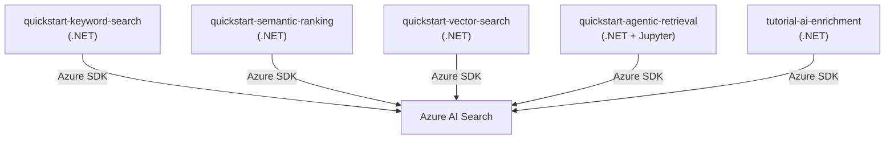
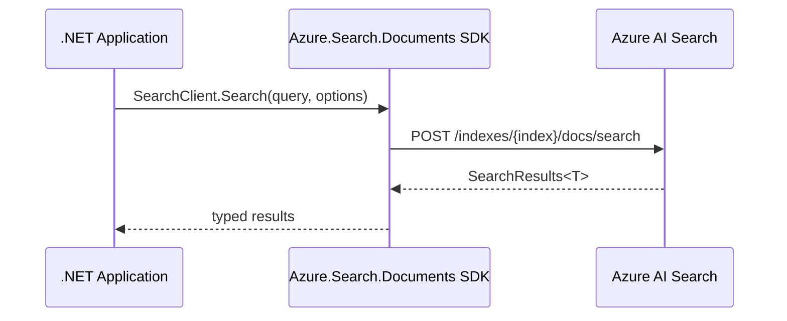
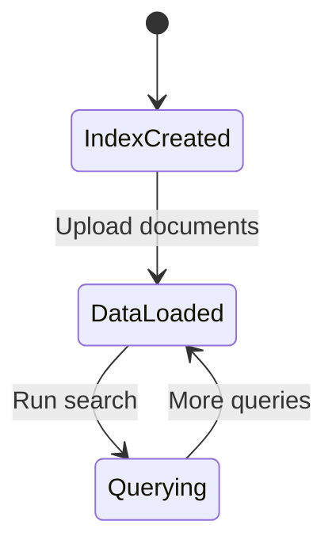

# azure-search-dotnet-samples — Overview

## What This Is
A collection of .NET quickstart samples for Azure AI Search — covering keyword search, semantic ranking, vector search, agentic retrieval, and AI enrichment pipelines.

## Who It's For
Developers building .NET applications using Azure AI Search, wanting runnable reference implementations for each search capability.

## Problem It Solves
Provides complete, buildable .NET sample projects for every major Azure AI Search feature — reducing integration time from docs to working code.

## How It's Used
Each subdirectory is an independent .NET solution covering a specific search pattern. Samples include Azure Bicep deployment templates, C# model classes, and program entry points.

## Component Stack

## Data Flow

## Behavioral Model

---
*Generated by github-repo-overview skill · Last updated: 2026-06-09 · Stack: .NET + C# + Azure AI Search SDK + Azure Bicep*
